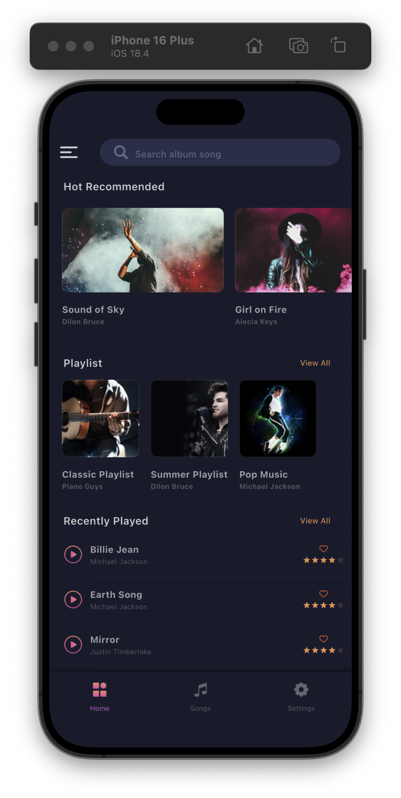
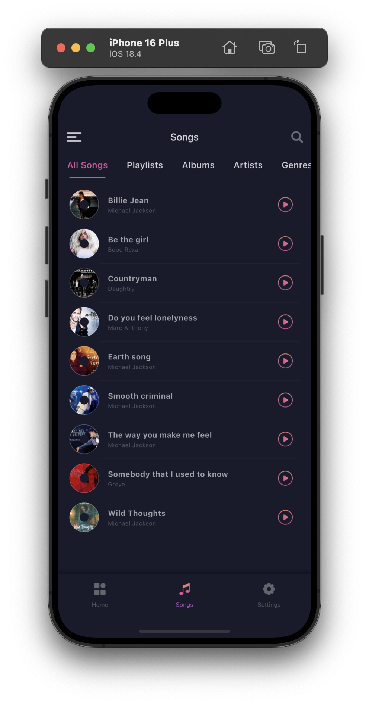
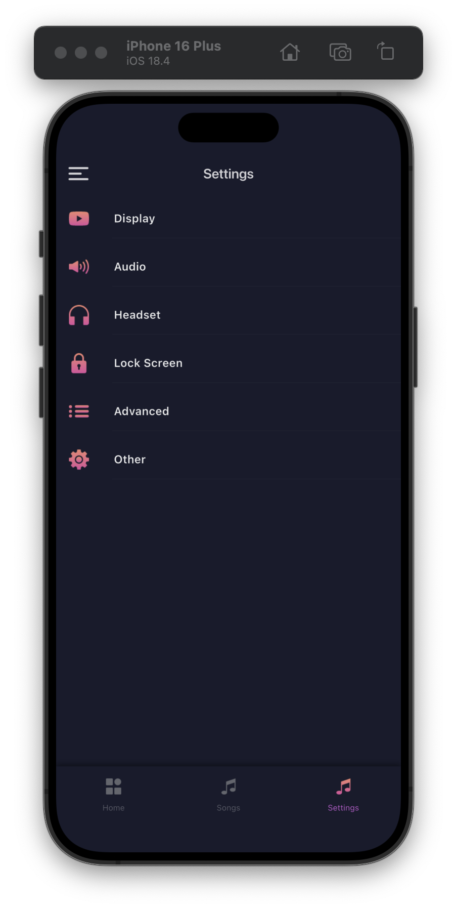
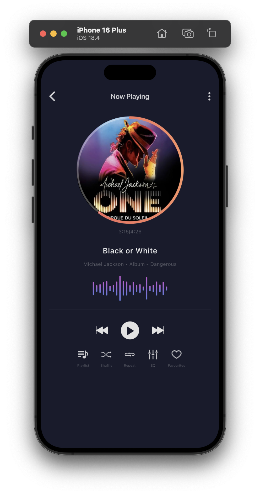

# melodify-music-platform

## Project Overview
Melodify is a modern, feature-rich music streaming application built with Flutter, offering an elegant and intuitive user interface for music enthusiasts. The app combines beautiful design with powerful functionality to deliver an exceptional music listening experience. Its primary purpose is to provide a functional and visually appealing music playback experience on mobile devices (iOS and Android), allowing users to browse their music library, play songs, view artist and album details, and manage playlists.

## Problem Statement
In today's digital age, music streaming apps often compromise either on user experience or functionality. Many apps either have cluttered interfaces or lack essential features that music lovers expect. Melodify addresses this gap by providing a seamless, feature-complete music streaming solution with a focus on user experience.

## Target Users / Use Cases
- Music enthusiasts seeking a premium listening experience
- Users who value both aesthetics and functionality
- Mobile users who want offline music playback
- People looking for a distraction-free music environment

## Tech Stack
- **Frontend Framework**: Flutter
- **State Management**: GetX
- **Audio Handling**:
  - just_audio
  - audio_service
- **UI Components**:
  - flutter_rating_bar
  - sleek_circular_slider
  - cached_network_image
- **Dependency Injection**: get_it
- **Font**: Circular Std (Custom font family)

## Methodology / Workflow
1. **Design Phase**: UI/UX design implementation using Flutter widgets
2. **Development Phase**: Feature implementation using GetX for state management
3. **Testing Phase**: Unit and widget testing
4. **Optimization Phase**: Performance tuning and code optimization

## Project Structure
```
.
├── assets/
│   ├── img/
│   └── fonts/
├── lib/
│   ├── audio_helpers/  # Logic for audio playback and services
│   ├── models/         # Data models (e.g., songs, albums, artists)
│   ├── pages/          # UI screens/pages of the application
│   └── widget/         # Reusable UI widgets
├── test/
└── pubspec.yaml
```

## Key Features
- Modern and intuitive user interface
- Smooth music playback with background support
- Offline music capability
- Custom rating system
- Circular progress indicator for playback
- Cached image loading for better performance
- Responsive design for various screen sizes

## Data Source & Preprocessing
- Local asset management for images and fonts
- Efficient caching system for network images
- Optimized audio file handling

## Challenges & Solutions
1. **Challenge**: Background audio playback
   **Solution**: Implemented audio_service for reliable background playback

2. **Challenge**: Image loading performance
   **Solution**: Utilized cached_network_image for efficient image caching

3. **Challenge**: State management complexity
   **Solution**: Implemented GetX for simplified state management

## Results & Impact
- Clean and intuitive user interface
- Smooth performance across different devices
- Efficient resource management
- Reliable audio playback experience

## Demo / Screenshots

<hr/>

<h2>Demo / Screenshots</h2>

<table>
  <tr>
    <td align="center">
      <br/>
      <b>Home Screen</b>
    </td>
    <td align="center">
      <br/>
      <b>Search Screen</b>
    </td>
  </tr>
  <tr>
    <td align="center">
      <br/>
      <b>Setting Screen</b>
    </td>
    <td align="center">
      <br/>
      <b>Detail Music Screen</b>
    </td>
  </tr>
</table>

<hr/>

## Future Improvements
- Social features integration
- Playlist management
- Equalizer implementation
- Cross-platform synchronization
- Offline mode enhancements
- Analytics integration

## Lessons Learned
- Importance of efficient state management in Flutter
- Best practices for audio handling in mobile applications
- Optimization techniques for better performance
- Effective use of custom fonts and assets

## Installation & Setup Guide
1. Ensure you have Flutter SDK installed.
2. Clone the repository:
   ```bash
   git clone https://github.com/Rizky28eka/melodify-music-platform.git
   ```
3. Navigate to the project directory:
   ```bash
   cd melodify-music-platform
   ```
4. Install dependencies:
   ```bash
   flutter pub get
   ```

## How to Run
To run the application on a connected device or emulator:
```bash
flutter run
```

## Contributing
Contributions are welcome! If you have suggestions for improvements, new features, or bug fixes, please follow these steps:
1. Fork the repository.
2. Create a new branch (`git checkout -b feature/your-feature-name` or `bugfix/your-bug-fix`).
3. Make your changes.
4. Commit your changes (`git commit -m 'feat: Add new feature'`).
5. Push to the branch (`git push origin feature/your-feature-name`).
6. Open a Pull Request.

Please ensure your code adheres to the project's coding style and includes relevant tests.

## Credits / Acknowledgments
- Flutter team for the amazing framework
- All package contributors
- Design inspiration from modern music apps
- Circular Std font family creators